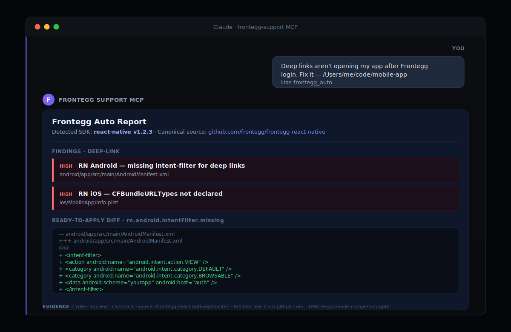
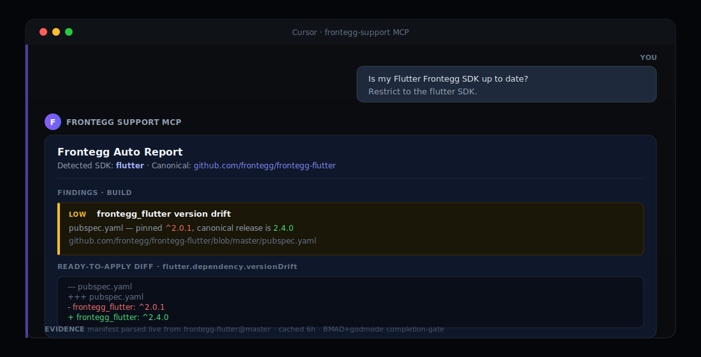
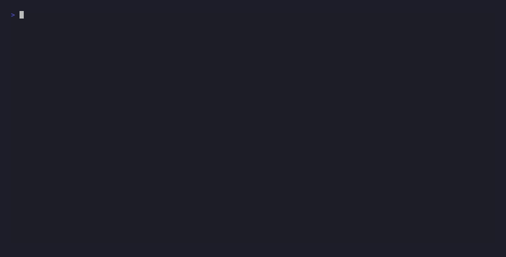
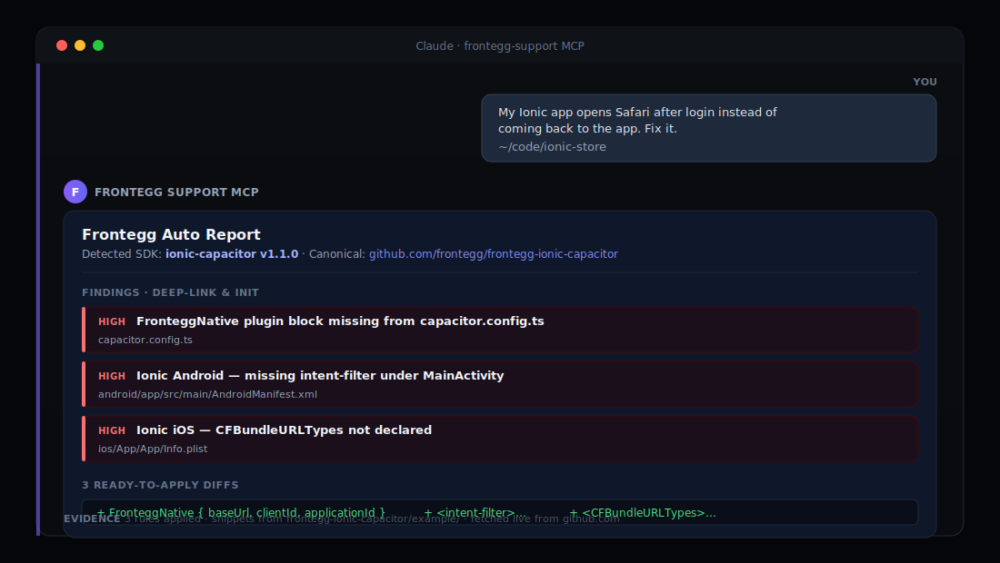
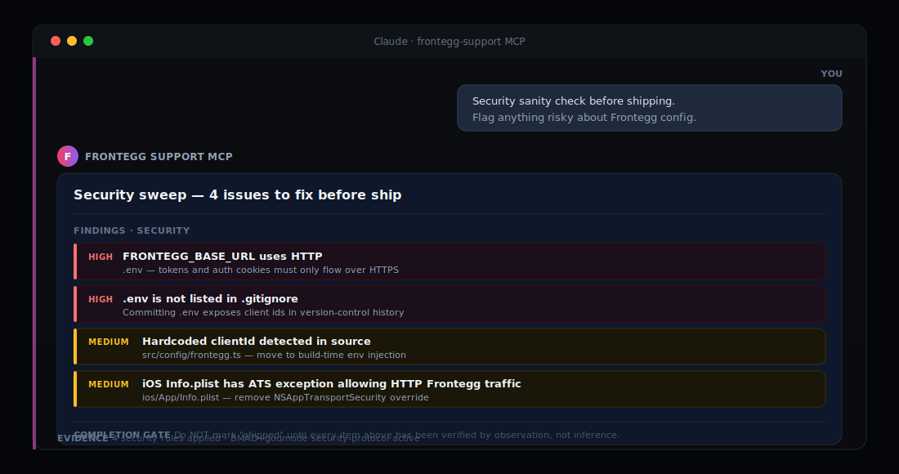

<div align="center">

# Frontegg MCP Server

### 96 tools — mobile-SDK audit/fix (47) + Frontegg Management API (49)

[](https://modelcontextprotocol.io)
[](https://nodejs.org)
[](#supported-sdks)
[](#tools)
[](#what-it-checks)
[](./LICENSE)

<br/>


<br/><br/>

**Diagnose. Apply real diffs. Configure your tenant from chat.**

<sub>Works with **Claude Desktop** · **Cursor** · **Claude Code** · any MCP-compatible client</sub>

</div>

<br/>

> **Companion repos:**
> - 🧠 [**`frontegg/coding-agent-skills`**](https://github.com/frontegg/coding-agent-skills) — 12 Claude Skills that orchestrate these tools end-to-end
> - 🚀 [**`frontegg/coding-agent-toolkit`**](https://github.com/frontegg/coding-agent-toolkit) — one-command installer that wires both into your AI client

<br/>

---

## Table of contents

- [Highlights](#highlights)
- [Supported SDKs](#supported-sdks)
- [Install](#install)
- [Development](#development)
- [Quick start](#quick-start)
- [What you can ask it](#what-you-can-ask-it)
- [Examples](#examples)
- [Tools](#tools)
- [What it checks](#what-it-checks)
- [Configuration](#configuration)
- [FAQ & troubleshooting](#faq--troubleshooting)

---

## Highlights

<table>
<tr>
<td width="33%" valign="top">

### Live canonical knowledge
Reads Frontegg SDK source from GitHub at runtime. Cache refreshes every 6 hours. Never stale.

</td>
<td width="33%" valign="top">

### 5-SDK auto-detection
Detects Android, iOS, Flutter, React Native, or Ionic. Runs the right detectors automatically.

</td>
<td width="33%" valign="top">

### Ready-to-apply diffs
Real unified diffs from official `example/` apps. `.bak` backups. `dry_run` preview.

</td>
</tr>
<tr>
<td width="33%" valign="top">

### CIAM feature guides
Setup steps and pitfalls for social login, passkeys, step-up auth, SSO, multi-tenancy, sessions, and more.

</td>
<td width="33%" valign="top">

### Tenant configuration from chat
Read and update MFA, sessions, SSO, identity, password policy, branding, audit logs, users, roles — direct via the Management API.

</td>
<td width="33%" valign="top">

### Security-aware
Flags `http://` base URLs, hardcoded credentials, `.env` outside `.gitignore`, iOS ATS exceptions — before you ship.

</td>
</tr>
</table>

<br/>

---

## Supported SDKs

<div align="center">

| Platform | Canonical repo | Coverage |
|---|---|:---:|
|  **Android (Kotlin)** | [`frontegg/frontegg-android-kotlin`](https://github.com/frontegg/frontegg-android-kotlin) | full |
|  **iOS (Swift)** | [`frontegg/frontegg-ios-swift`](https://github.com/frontegg/frontegg-ios-swift) | full |
|  **Flutter** | [`frontegg/frontegg-flutter`](https://github.com/frontegg/frontegg-flutter) | full |
|  **React Native** | [`frontegg/frontegg-react-native`](https://github.com/frontegg/frontegg-react-native) | full |
|  **Ionic / Capacitor** | [`frontegg/frontegg-ionic-capacitor`](https://github.com/frontegg/frontegg-ionic-capacitor) | full |

</div>

---

## Install

This server installs **standalone** — no other Frontegg tooling required. The package is published on npm as [`@frontegg/frontegg-mcp-server`](https://www.npmjs.com/package/@frontegg/frontegg-mcp-server). Wire it directly into any MCP-compatible client; `npx` fetches the latest version on first run.

> **Want the tenant configuration tools (MFA, SSO, users, branding, audit logs, etc.)?** Set the `FRONTEGG_CLIENT_ID` + `FRONTEGG_API_KEY` env vars in your client's MCP config. The diagnose / fix tools work without them. See [Configuration](#configuration) for where to find your Frontegg credentials.

<details open>
<summary><b>Cursor</b></summary>

<br/>

Edit `~/.cursor/mcp.json`:

```json
{
  "mcpServers": {
    "frontegg": {
      "command": "npx",
      "args": ["--yes", "@frontegg/frontegg-mcp-server"],
      "env": {
        "FRONTEGG_CLIENT_ID": "your-client-id",
        "FRONTEGG_API_KEY": "your-api-secret"
      }
    }
  }
}
```

Reload Cursor. Tools appear in the chat sidebar in Agent mode.

> Drop the `env` block if you only need diagnose/fix tools (no tenant API).

</details>

<details>
<summary><b>Claude Desktop</b></summary>

<br/>

Edit `~/Library/Application Support/Claude/claude_desktop_config.json` (macOS) or `%APPDATA%\Claude\claude_desktop_config.json` (Windows). Same JSON block as Cursor. Quit and relaunch.

</details>

<details>
<summary><b>Claude Code CLI</b></summary>

<br/>

```bash
claude mcp add frontegg \
  -e FRONTEGG_CLIENT_ID=your-client-id \
  -e FRONTEGG_API_KEY=your-api-secret \
  -- npx --yes @frontegg/frontegg-mcp-server
```

Omit the `-e` flags if you only need diagnose/fix tools.

</details>

<details>
<summary><b>Any other MCP client</b></summary>

<br/>

Speaks MCP over stdio. Launch with `npx --yes @frontegg/frontegg-mcp-server`. Set `FRONTEGG_CLIENT_ID` and `FRONTEGG_API_KEY` in the process environment if you need tenant API tools.

</details>

<details>
<summary><b>Want the combined stack (MCP + skills + auto-wiring + credential validation)?</b></summary>

<br/>

That's what the [`coding-agent-toolkit`](https://github.com/frontegg/coding-agent-toolkit) does:

```bash
npx @frontegg/coding-agent-toolkit init
```

It auto-detects your client, validates your Frontegg credentials against the Management API before saving them, wires the MCP entry, and installs the matching skills. Use it when you want both the MCP and skills in one go. MCP-only users don't need it — the per-client snippets above are sufficient.

</details>

---

## Development

To build from source (for contributing or running a fork):

```bash
git clone https://github.com/frontegg/frontegg-mcp-server.git
cd frontegg-mcp-server
npm install
npm run build              # tsc → dist/
npm test                   # 215 jest + 89 vitest
```

Point your client at `node /absolute/path/to/frontegg-mcp-server/dist/index.js` to test local changes.

> **Using `nvm`?** GUI apps don't inherit your shell PATH. Use the absolute path from `which node`.

---

## Quick start

Open your mobile project. Ask your assistant:

```text
Use frontegg_auto on this project and tell me what's wrong with my Frontegg setup.
```

The MCP will:

1. **Detect** your SDK (Android / iOS / Flutter / RN / Ionic)
2. **Fetch** the canonical Frontegg repo from GitHub
3. **Diagnose** the project — findings grouped by deep-link, init, auth, build, security
4. **Generate** unified diffs from the official `example/` app
5. **Apply** on request via `frontegg_apply_diff`

Iterate until clean.

---

## What you can ask it

No tool names required. Plain language works:

<table>
<tr>
<td width="50%">

> _"Why isn't my React Native login redirect coming back?"_

Finds the missing intent-filter / URL scheme / Associated Domain. Returns a patch.

</td>
<td width="50%">

> _"Is my frontegg_flutter version up to date?"_

Compares `pubspec.yaml` against the latest release. Flags drift.

</td>
</tr>
<tr>
<td width="50%">

> _"How do I set up Apple Sign In with Frontegg?"_

Returns setup steps and pitfalls from the CIAM guides.

</td>
<td width="50%">

> _"Show me the current MFA policy."_

Reads your tenant's MFA config via the Management API.

</td>
</tr>
<tr>
<td width="50%">

> _"Force MFA for all users except SSO."_

Updates the MFA policy. No portal click.

</td>
<td width="50%">

> _"Security sanity check before shipping."_

Flags hardcoded credentials, HTTP URLs, `.env` issues, ATS exceptions.

</td>
</tr>
</table>

---

## Examples

<details open>
<summary><h3>① React Native deep links aren't working</h3></summary>

> _Use `frontegg_auto` on `/Users/me/code/my-rn-app`. Login redirects to Safari and never returns._

Detects RN, fetches `frontegg-react-native`, identifies the missing `intent-filter` and `CFBundleURLTypes`, returns the exact diff from the example app.

<p align="center">
  
</p>

```bash
npm run demo:rn
```

</details>

---

<details open>
<summary><h3>② Flutter SDK out of date</h3></summary>

> _Run the Frontegg MCP on my Flutter app. Restrict to the flutter SDK._

<p align="center">
  
</p>

Reads `pubspec.yaml`, compares against the current `frontegg-flutter` release. Returns a one-line bump diff.

<p align="center">
  
</p>

```bash
npm run demo:flutter
```

</details>

---

<details open>
<summary><h3>③ Ionic app opens Safari after login</h3></summary>

> _My Ionic app opens Safari after login. Fix it — `~/code/ionic-store`._

<p align="center">
  
</p>

One pass identifies: missing `FronteggNative` plugin block in `capacitor.config.ts`, absent `intent-filter` in the Android shell, missing `CFBundleURLTypes` in iOS. Diffs sourced from `frontegg-ionic-capacitor/example`.

<p align="center">
  
</p>

```bash
npm run demo:ionic
```

</details>

---

<details open>
<summary><h3>④ Security sanity check</h3></summary>

> _Use `frontegg_auto` on this project. Security issues only._

<p align="center">
  
</p>

Flags HTTP base URLs, `.env` outside `.gitignore`, hardcoded `clientId`s, iOS ATS exceptions. Each finding ships with a completion gate — won't mark work shipped until every item is verified.

<p align="center">
  
</p>

```bash
npm run demo:security
```

</details>

---

<details open>
<summary><h3>⑤ Configure MFA from chat</h3></summary>

> _Show me the current MFA policy. Then force MFA for everyone except SSO._

```text
> frontegg_configure_mfa action=get

  enforceMFAType: DontForce
  allowRememberMyDevice: true
  mfaDeviceExpiration: 1209600

> frontegg_configure_mfa action=update enforceMFAType=ForceExceptSAML

  enforceMFAType: ForceExceptSAML  ✓
```

</details>

---

## Tools

**96 tools across two surfaces.**

### Two-surface model

This server exposes two distinct tool surfaces, registered into a single MCP:

- **Mobile / audit surface** (47 tools, snake_case names with `frontegg_` prefix) — diagnose/fix SDK integration issues, configure tenants, audit user activity. Originally `frontegg-mobile-mcp-server`.
- **Platform surface** (49 tools, kebab-case names) — full CRUD over Frontegg roles, permissions, applications, users, tenants, vendor integrations, API tokens. Imported from [`frontegg/frontegg-mcp-server`](https://github.com/frontegg/frontegg-mcp-server).

Both surfaces share the same `FRONTEGG_CLIENT_ID` + `FRONTEGG_API_KEY` (alias `FRONTEGG_SECRET_KEY`) credentials. Naming conventions differ for v1 to avoid breaking either upstream's existing integrations; a future v2 may unify.

---

### Mobile / audit surface (47 tools)

### Diagnosis & fix (10)

| Tool | What it does |
|---|---|
| `frontegg_auto` | **Start here.** Full diagnosis + diffs in one pass. |
| `frontegg_apply_diff` | Apply diffs to disk. `.bak` backups. `dry_run` support. |
| `analyze_repo` | Run detectors. Return raw findings. |
| `generate_diffs` | Generate diffs for specific finding IDs. |
| `list_rules` | Browse the rule catalog. Auto-filtered to your SDK. |
| `explain_finding` | Explain a rule with troubleshooting steps. |
| `read_resource` | Read a project file or directory listing. |
| `detect_android_issues` | Android detector only. |
| `detect_ios_issues` | iOS detector only. |
| `detect_common_issues` | Cross-platform checks (env, credentials, base URL). |

### CIAM feature guides (1)

| Tool | What it does |
|---|---|
| `frontegg_feature_guide` | Setup steps and pitfalls for: social login, passkeys, step-up, sessions, tokens, security rules, hosted vs embedded, multi-tenancy, entitlements, SMS login, SSO, password policies. |

### Auth (1, optional)

| Tool | What it does |
|---|---|
| `frontegg_login` | OAuth 2.0 PKCE login against your Frontegg tenant. Optional — the API tools below use `FRONTEGG_CLIENT_ID` + `FRONTEGG_SECRET` env vars directly. |

### Tenant configuration (10)

Calls the **Frontegg Management API**. Requires `FRONTEGG_CLIENT_ID` + `FRONTEGG_SECRET` (see [Configuration](#configuration)).

| Tool | What it does |
|---|---|
| `frontegg_configure_mfa` | MFA policy (enforcement, remember device, expiration). |
| `frontegg_configure_sessions` | Session config. *(Vendor-token PATCH may silently no-op on some tenants.)* |
| `frontegg_configure_sso` | List or create a social login provider (google, github, microsoft, facebook, linkedin, gitlab, slack, twitter, apple). |
| `frontegg_configure_identity` | Auth config (strategy, token TTLs, signups, JWT claims, SameSite cookies). |
| `frontegg_configure_password_policy` | Password complexity (min length, history). |
| `frontegg_configure_lockout_policy` | Account lockout (threshold, duration). |
| `frontegg_configure_security_rules` | Read CAPTCHA / threat-protection policy. *(Write needs real reCAPTCHA keys.)* |
| `frontegg_email_templates_list` / `_update` | Tenant email templates. *(Vendor-token-blocked on some tenants.)* |
| `frontegg_branding_get` / `_update` | Tenant branding (logo, primary color, theme). |

### Users, tenants, RBAC, audit (11)

| Tool | What it does |
|---|---|
| `frontegg_users_list` | List users with filters. |
| `frontegg_users_invite` | Send an invitation email. |
| `frontegg_audit_logs` | Query auth events. |
| `frontegg_tenants_list` | List tenants. |
| `frontegg_roles_list` / `_create` | RBAC roles. |
| `frontegg_user_sessions_list` | Active sessions for a user. |
| `frontegg_user_session_revoke` | Kick one session. |
| `frontegg_user_sessions_revoke_all` | Kick all sessions for a user (requires `confirm: true`). |
| `frontegg_user_mfa_get` | Read a user's MFA factors. |
| `frontegg_user_mfa_reset` | Admin-reset a user's MFA. |
| `frontegg_user_mfa_enforce` | *(Vendor-token can't force MFA per-user; use `frontegg_configure_mfa` for tenant-wide.)* |

### Applications, webhooks, entitlements, API tokens (10)

| Tool | What it does |
|---|---|
| `frontegg_applications_list` / `_get` / `_create` | Application records in the vendor environment. |
| `frontegg_webhooks_list` / `_create` | Webhook subscriptions. |
| `frontegg_features_list` / `_create` | Feature flags (entitlements). |
| `frontegg_plans_list` | Subscription plans. |
| `frontegg_plan_feature_attach` | Attach a feature to a plan. *(Write may no-op on vendor-token tenants.)* |
| `frontegg_api_tokens_list` / `_create` / `_revoke` | Tenant- or user-scoped API tokens. Create returns the secret once. |

Each API tool: `action="get"` (or `"list"`) reads, `action="update"` (or `"create"`) writes.

### Known limitations

A few tools ship partial because the Frontegg vendor-token API doesn't expose the needed surface:

- `frontegg_configure_sessions` write can silently no-op
- `frontegg_configure_security_rules` write needs real reCAPTCHA keys
- `frontegg_email_templates_*` 404 on vendor tokens (tenant-scoped admin required)
- `frontegg_user_mfa_enforce` — per-user endpoint not exposed
- `frontegg_plan_feature_attach` write may no-op
- `frontegg_configure_sso` can list and create — cannot delete or disable

Each affected tool's `description` field flags the limitation so the LLM picks an alternative when one exists.

---

### Platform surface (49 tools)

Imported from [`frontegg/frontegg-mcp-server`](https://github.com/frontegg/frontegg-mcp-server) — full CRUD over Frontegg's management plane. Tool names are kebab-case to preserve compatibility with anyone already integrated against upstream.

#### Roles (5)

| Tool | What it does |
|---|---|
| `get-roles` | List all roles in your tenant. |
| `create-role` | Create a new role with name + description. |
| `update-role` | Rename or re-describe an existing role. |
| `delete-role` | Delete a role. Irreversible. |
| `set-permissions-to-role` | Replace a role's full permission set. |

#### Permissions (10)

| Tool | What it does |
|---|---|
| `get-permissions` | List all permissions. |
| `create-permission` | Create a new permission (key + name + category). |
| `update-permission` | Rename/rephrase a permission. |
| `delete-permission` | Delete a permission. Cascades across roles. |
| `set-permission-to-multiple-roles` | Attach one permission to N roles at once. |
| `set-permissions-classification` | Classify permissions (PII/PHI/read-write). |
| `get-permission-categories` | List permission categories. |
| `create-permission-category` | Create a new category bucket. |
| `update-permission-category` | Rename a category. |
| `delete-permission-category` | Delete a category (only if empty). |

#### Users (4)

| Tool | What it does |
|---|---|
| `get-users` | Paginated list with filters (email, tenant, sort). |
| `invite-user` | Create + invite a user. Optional `skipInviteEmail`. |
| `update-user` | Edit user fields. |
| `delete-user` | Delete a user. |

#### Tenants (3)

| Tool | What it does |
|---|---|
| `create-tenant` | Create a new tenant. |
| `update-tenant` | Edit tenant fields. |
| `delete-tenant` | Delete a tenant. Irreversible. |

> Listing tenants is available via the mobile surface's `frontegg_tenants_list`.

#### Applications (6)

| Tool | What it does |
|---|---|
| `get-applications` | List standard applications. |
| `get-users-for-application` | List users assigned to an app. |
| `assign-users-to-application` | Assign users to an app. |
| `get-agent-applications` | List agent (LLM-actor) applications. |
| `create-agent-application` | Create a new agent application. |
| `update-agent-application` | Edit an agent application. |

#### API Tokens (7)

| Tool | What it does |
|---|---|
| `create-token` | Create a vendor API token. |
| `get-tokens` | List vendor API tokens. |
| `delete-token` | Revoke a vendor API token. |
| `create-client-credentials` | Create a client-credentials token pair. |
| `get-client-credentials` | List client-credentials tokens. |
| `update-client-credentials` | Edit a client-credentials token's metadata. |
| `delete-client-credentials` | Revoke a client-credentials token. |

#### Personal Tokens (6)

| Tool | What it does |
|---|---|
| `get-user-access-tokens` | List a user's access tokens. |
| `create-user-access-token` | Create a user access token. |
| `delete-user-access-token` | Revoke a user access token. |
| `get-user-api-tokens` | List a user's API tokens. |
| `create-user-api-token` | Create a user API token. |
| `delete-user-api-token` | Revoke a user API token. |

#### Vendor Integrations (6)

| Tool | What it does |
|---|---|
| `get-vendor-integrations` | List integrations your tenant publishes. |
| `create-vendor-integration` | Publish a new vendor integration (app-to-app or behalf-of-user). |
| `update-vendor-integration` | Edit a vendor integration. |
| `delete-vendor-integration` | Delete a vendor integration. |
| `assign-agents-to-vendor-integration` | Grant N agents access through the integration. |
| `unassign-agents-from-vendor-integration` | Revoke agents' access. |

#### Frontegg Integrations (2)

| Tool | What it does |
|---|---|
| `get-frontegg-integrations` | List first-party connectors Frontegg ships (Slack, webhooks, etc.). |
| `get-frontegg-integration` | Inspect one connector's config schema + activation state. |

> Activating/configuring Frontegg integrations beyond reading their state requires the Frontegg portal — the API surface is read-only at v1.

---

## What it checks

**135+ rules** across four layers:

- **Detection** — missing intent-filter, CFBundleURLTypes, Associated Domains, init call, INTERNET permission, ATS exceptions, `.env` outside `.gitignore`
- **Config flags** — `embeddedMode`, `lateInit`, `useAssetsLinks`, `useChromeCustomTabs`, `enableOfflineMode`, `enableSessionPerTenant`, `useLegacySocialLoginFlow`, and dozens more per SDK
- **Advisory (real support cases)** — cold-start deep-link crashes, refresh-token fatals, Doze Mode, R8/ProGuard stripping, tenant permission bleed, WebView issues
- **CIAM feature** — Apple/Google social login, passkeys (`webcredentials:` / asset links), step-up, SSO, sessions, tokens, SMS, password policies

> Run `list_rules` inside your project — only relevant rules appear. Pass `all: true` for the full catalog.

---

## Configuration

### Optional (all tools)

```bash
GITHUB_TOKEN=ghp_xxx           # Lifts GitHub rate limits — recommended for heavy use
LOG_LEVEL=info                 # error | warn | info | debug
```

### Frontegg credentials (tenant configuration tools only)

The `frontegg_configure_*`, `users`, `tenants`, `roles`, `audit_logs`, `branding`, `webhooks`, `applications`, `features`, `plans`, `api_tokens`, and `user_sessions` / `user_mfa` admin tools need vendor credentials:

```bash
FRONTEGG_CLIENT_ID=your-client-id   # UUID — your Frontegg environment's client ID
FRONTEGG_SECRET=your-api-secret     # UUID — your Frontegg environment's API key
```

**Where to find them in the Frontegg portal:**

1. Log into [https://portal.frontegg.com](https://portal.frontegg.com)
2. Pick the workspace and environment you want to manage
3. Navigate to **⚙️ Settings → Workspace Settings → Environment** (path may differ slightly by portal version — search "API Key" or "Client ID" if you can't find it)
4. Copy the **Client ID** and **API Key** values

Both are UUIDs in the format `xxxxxxxx-xxxx-xxxx-xxxx-xxxxxxxxxxxx`.

**Without these:** diagnose / fix tools (`analyze_repo`, `apply_diff`, `feature_guide`, etc.) work normally. Only the tenant-API tools error.

**Where to put them:**

- **`.env` file** at the MCP server's directory (works for local development)
- **Your MCP client's config** (Cursor `~/.cursor/mcp.json`, Claude Desktop `claude_desktop_config.json`, etc.) — recommended:

```json
{
  "mcpServers": {
    "frontegg-mobile": {
      "command": "node",
      "args": ["/absolute/path/to/frontegg-mcp-server/dist/index.js"],
      "env": {
        "GITHUB_TOKEN": "ghp_xxx",
        "FRONTEGG_CLIENT_ID": "your-client-id",
        "FRONTEGG_SECRET": "your-api-secret"
      }
    }
  }
}
```

**Verify your credentials work** — in your MCP client's chat, ask:

```text
Use frontegg_configure_mfa with action=get to read my tenant's MFA policy.
```

A successful response returns the current MFA config. An error like *"FRONTEGG_CLIENT_ID and FRONTEGG_SECRET environment variables are required"* means the env vars didn't reach the MCP — double-check spelling and that you restarted the client after editing the config.

---

## FAQ & troubleshooting

<details>
<summary><b>Will it modify my files?</b></summary>
<br/>
Only via <code>frontegg_apply_diff</code>, when you ask. Creates <code>.bak</code> backups. Use <code>dry_run: true</code> to preview.
</details>

<details>
<summary><b>Will the API tools change my Frontegg environment?</b></summary>
<br/>
Only with <code>action="update"</code>. Reading is safe.
</details>

<details>
<summary><b>Does it send my code anywhere?</b></summary>
<br/>
No. Analysis is local. Outbound calls go to <code>raw.githubusercontent.com</code> (public SDK repos) and <code>api.frontegg.com</code> (only with credentials and the <code>frontegg_configure_*</code> tools).
</details>

<details>
<summary><b>Do I need a Frontegg account?</b></summary>
<br/>
Not for diagnosis, diffs, or feature guides. The <code>frontegg_configure_*</code> tools need vendor credentials.
</details>

<details>
<summary><b>Server not showing up in my client?</b></summary>
<br/>

- Verify the absolute path to `dist/index.js`
- Run `npm run build` first
- Test directly: `node /path/to/dist/index.js` — should print startup logs
- Cursor: switch to Agent mode. Toggle the server off/on in Settings.

</details>

<details>
<summary><b>"No issues detected" but something's wrong?</b></summary>
<br/>

- Point it at the project root, not a subdirectory
- Pass `sdk` explicitly: `android-kotlin`, `ios-swift`, `flutter`, `react-native`, or `ionic-capacitor`

</details>

<details>
<summary><b>GitHub rate limits?</b></summary>
<br/>
Set <code>GITHUB_TOKEN</code> — even a no-scope token helps. Knowledge cache holds for 6 hours.
</details>

<details>
<summary><b>Connection errors?</b></summary>
<br/>
Usually <code>node</code> isn't on the GUI app PATH. Use the absolute path from <code>which node</code> or the bundled <code>bin/mcp-launcher.sh</code>.
</details>

<details>
<summary><b>Works offline?</b></summary>
<br/>
Partially. Detectors run locally. Version-drift checks and API tools need network.
</details>

<details>
<summary><b>Can I run it in CI?</b></summary>
<br/>
Yes. Standard Node 18+ over stdio. Set <code>GITHUB_TOKEN</code> to avoid rate limits.
</details>

---

<div align="center">

**Built for developers integrating Frontegg into mobile apps.**

Every answer cites a Frontegg SDK file. Every diff is ready to paste. Every claim is evidence-backed.

</div>
